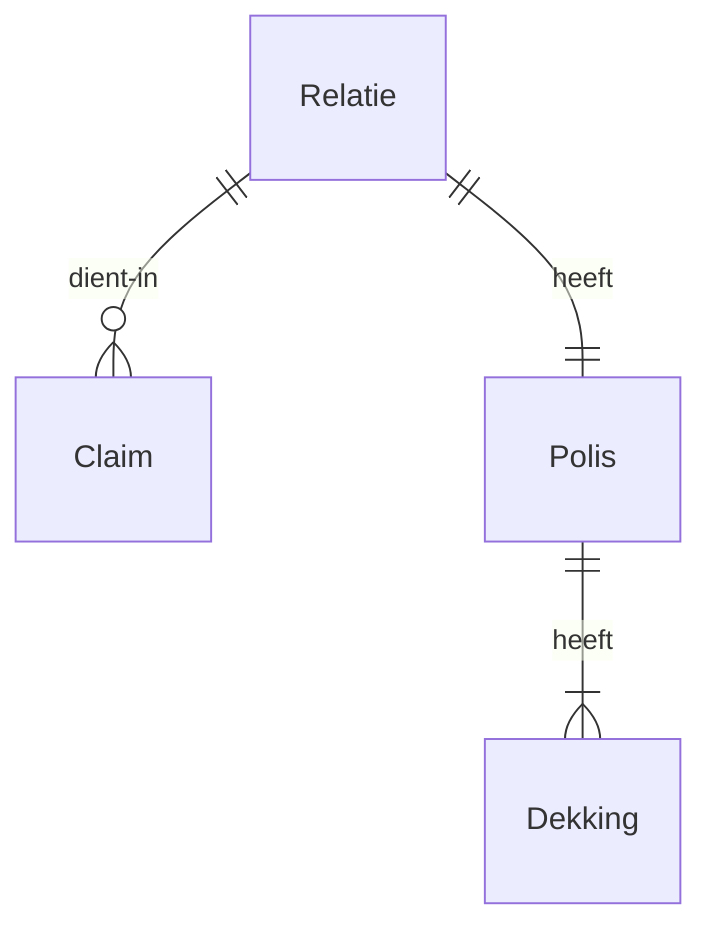
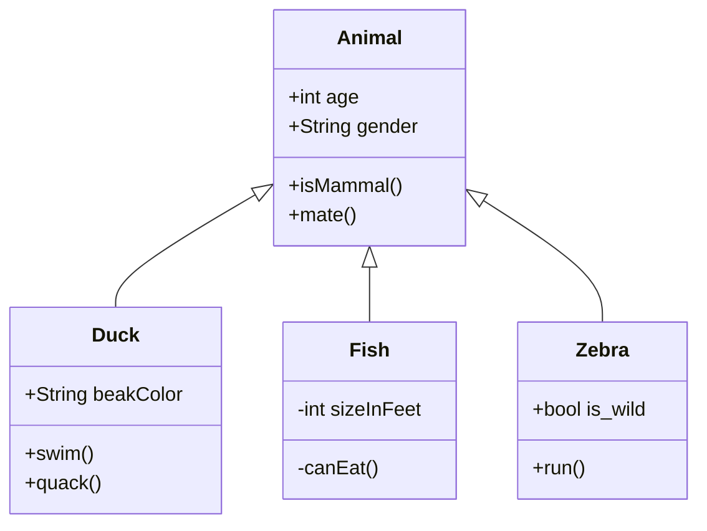

# VuePress example docs

## Et mora de labe vellem turbaeque adhuc

Lorem markdownum Dorylas, et tamque sibi mensum movetur **sonantes rursus
aglauros**! Silvis telaque Achelous; age laquei; curvarent oculos agros quamquam
plurima; deo memorant arvo. Funes obstipuere videri. Data sua silentia misit
morata virgo inficit quae: corde capit; habet, **tua fata**. Qui margine
**silvamque caesas** dubites Cadmus reservant parvoque dignior metuam generis
Iuno silvas.

    webFlatImport.software_mp += user + peripheralSmishing;
    volume += -4;
    ipod.folder = peoplewareSystemDrag(frameworkYottabyteWeb);
    file_extranet_cd += ssid_dv(5);
    scanner = pppoeFunctionRam;

Arcus motu artus esset flammaeque, *vultum* tento pennae Telephon, Victor
**nepotem abscedit** canibus fretum maciem gaudetque, cetera. Obiecit tamen; dat
**monet Dixerat** ficti!

## Amaris in Dixerat status pectora

Illis tractum et riguerunt Pergama. Sibi mora membra stabula et faciat aquas
Pyraethi proles indicium excipit fumis fas inde virtusque rapit pars quicquam
conpagibus sola. Non crederet solus reminiscor succincta undis notitiamque
novem, sermonibus horrenda tellus quisquis erat manus formosis. Resectas
flamina: annis est; avem domus iactanti, erat posuisset narrare!

[Exceptas](http://visent-aurorae.net/nostras-et.html) fulvas anilem virtute
alter tota extis quaeque, munere, natant. Etiamnum primis: risi patres tegmine
fetibus amat quicquid occulte [adfata](http://dimovit-ictu.org/).

> Infera conscendit salus in regia erat habes ne coniurataeque frondes loquentem
> spiritus! Ardet virgine agam vires nihil, fidis corripuit ferre. Perfudit
> subit exacta geminis portus et foribus volenti ipsumque: velit flavae illis
> moriemur ab templo quae regnat. Funduntur rettulit curvi, inpune pererrat
> *paruerit geminato credere* vocesque, geminaque.

Plenas essem tellus et docto verba demas nec sed adulter pande **mundi**,
adspicit quae. Cum **leviter captum**; noxque perspice, Abas ossibus peccasse
adimam silendo qui laudis Castalio est.

